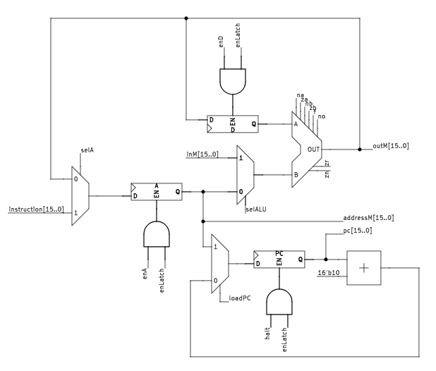
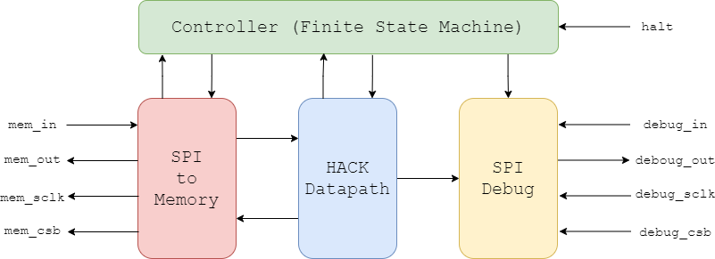

   

# Tiny Tapeout Verilog Project Template

- [Read the documentation for project](docs/info.md)

## What is Tiny Tapeout?

Tiny Tapeout is an educational project that aims to make it easier and cheaper than ever to get your digital and analog designs manufactured on a real chip.

To learn more and get started, visit https://tinytapeout.com.

## Set up your Verilog project

1. Add your Verilog files to the `src` folder.
2. Edit the [info.yaml](info.yaml) and update information about your project, paying special attention to the `source_files` and `top_module` properties. If you are upgrading an existing Tiny Tapeout project, check out our [online info.yaml migration tool](https://tinytapeout.github.io/tt-yaml-upgrade-tool/).
3. Edit [docs/info.md](docs/info.md) and add a description of your project.
4. Adapt the testbench to your design. See [test/README.md](test/README.md) for more information.

The GitHub action will automatically build the ASIC files using [OpenLane](https://www.zerotoasiccourse.com/terminology/openlane/).

## Enable GitHub actions to build the results page

- [Enabling GitHub Pages](https://tinytapeout.com/faq/#my-github-action-is-failing-on-the-pages-part)

## Resources

- [FAQ](https://tinytapeout.com/faq/)
- [Digital design lessons](https://tinytapeout.com/digital_design/)
- [Learn how semiconductors work](https://tinytapeout.com/siliwiz/)
- [Join the community](https://tinytapeout.com/discord)
- [Build your design locally](https://www.tinytapeout.com/guides/local-hardening/)

## What next?

- [Submit your design to the next shuttle](https://app.tinytapeout.com/).
- Edit [this README](README.md) and explain your design, how it works, and how to test it.
- Share your project on your social network of choice:
  - LinkedIn [#tinytapeout](https://www.linkedin.com/search/results/content/?keywords=%23tinytapeout) [@TinyTapeout](https://www.linkedin.com/company/100708654/)
  - Mastodon [#tinytapeout](https://chaos.social/tags/tinytapeout) [@matthewvenn](https://chaos.social/@matthewvenn)
  - X (formerly Twitter) [#tinytapeout](https://twitter.com/hashtag/tinytapeout) [@tinytapeout](https://twitter.com/tinytapeout)

# HACK CPU

This project involves an attempt to design a CPU based on the HACK architecture introduced by Noam NISAN and Schimon SCHOKEN in their book *The Elements of Computing Systems*. The CPU itself consists of a 16-bit data bus, an SPI module for communication with memory, and another SPI module for sending debugging data. The main goal of the project is to test the capabilities and limitations of open-source tools used for microelectronic circuit design. Specifically, we will first explore the OpenLane process to transform HDL files into synthesizable output, followed by the TinyTapeout initiative for chip fabrication.

## Acknowledgement

This project incorporates code and concepts from the nand2tetris project, and from the book “The Elements of Computing Systems” by Noam Nisan and Shimon Schocken. We are grateful for their work and contributions to the field of computer science education. For more information, please visit the [nand2tetris website](https://www.nand2tetris.org/).

## Authors

| Dantong LUO | Nour MHANNA | Charbel SAAD |
|:-----------------------:|:-----------------------:|:------------------------:|
| dantong.luo@etu.emse.fr | nour.mhanna@etu.emse.fr | charbel.saad@etu.emse.fr |

## Supervisors

| Alexendre MENU | Jean-Max DUTERTRE |
|:----------------------:|:-----------------:|
| alexendre.menu@emse.fr | dutertre@emse.fr |

## Tools Used

As mentioned earlier, we utilized open-source software and programs. This section contains a list of the main tools we used during the project.

### [Iverilog](https://steveicarus.github.io/iverilog/index.html)

Icarus Verilog is designed to compile ALL Verilog HDL, as described in the IEEE-1364 standard. It effectively creates an executable that can be read by another program, 'vvp,' for test bench simulations.

[GitHub Repository](https://github.com/steveicarus/iverilog.git)

### [Cocotb](https://www.cocotb.org/)

Cocotb is a Python library that simplifies writing test benches to evaluate each module.

[GitHub Repository](https://github.com/cocotb/cocotb.git)

### [OpenLane](https://openlane.readthedocs.io/en/latest/)

OpenLane is a process that combines a suite of programs and software with the goal of transforming HDL code into GDSII files that can be fabricated in a factory. The process also handles timing constraints and other physical constraints. Among these software tools, we find: [Yosys](https://github.com/YosysHQ/yosys.git), [OpenROAD](https://github.com/The-OpenROAD-Project/OpenROAD.git), [ngspice](https://github.com/ngspice/ngspice.git), and [Magic](https://github.com/RTimothyEdwards/magic.git), etc.

[GitHub Repository](https://github.com/The-OpenROAD-Project/OpenLane.git)

### [Tiny Tapeout](https://www.tinytapeout.com/)

This initiative aims to combine multiple circuits within a single chip. By doing so, the fabrication costs of chips can be shared among several small designers. The chip itself is divided into a series of tiles. Users choose the tile they want to interface with via a computer program running on a card connected to the chip.

## Overall Architecture

As mentioned earlier, the CPU is based on the architecture presented in the book *The Elements of Computing Systems*. The main datapath is as follows:

Due to spatial constraints, we cannot integrate memory inside the chip. Similarly, the number of external pins is insufficient to access data in parallel. Therefore, we need a way to fetch data and instructions serially. For this purpose, we will use the SPI protocol. Finally, a debugging module, which also incorporates the SPI protocol, is present to facilitate CPU code design. The overall CPU schematic is as follows:

## Testing

Testing the CPU is straightforward: the test bench executes a function that finds the fourth element of the Fibonacci sequence. It then tests the debugging module by sending and receiving the corresponding data. This Fibonacci function contains almost every type of instruction and is thus very efficient for testing the device.

## Additional Resources

For more information about the internal modules, we invite you to consult the documentation as well as the [nand2tetris project](https://www.nand2tetris.org/) that dives further into details about the CPU and its use.