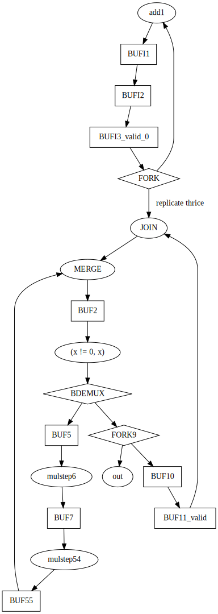

   

# A simple asynchronous multiplier example

This design emits a sequence of `r` = x^2+x, for x=0,1,2,... on the
outputs using the handshake protocol (tie ack to req to get free
running sequence).  Well, in truth, we use 26-bits of internal
precision, but we only have 15-bits for outputs, we what is actually
emitted is `r ^ (r >> 15)`.

The very naive algorithm (with the body unrolled once) is

``` python
x = 0
loop:
  x = x + 1
  a = b = c = x
  while b != 0:
    if (b & 1) == 1:
      c += a
    a *= 2
    b /= 2
    if (b & 1) == 1:
      c += a
    a *= 2
    b /= 2
  output (c)
```

which was hand translated (roughly following [Introduction to
Asynchronous Circuit
Design](https://orbit.dtu.dk/files/215895041/JSPA_async_book_2020_PDF.pdf)
) into a token flow graph:



Note, I use a simpler, less expensive, construction for the
conditional iteration as having independent control-flow for the
trivial condition is overkill.

The graph was realized using four-phase bundled data.  Alas, I'm still
working on the timing analysis, so the inserted delays are (hopefully)
way oversized.

# Tiny Tapeout Verilog Project Template

- [Read the documentation for project](docs/info.md)

## What is Tiny Tapeout?

Tiny Tapeout is an educational project that aims to make it easier and cheaper than ever to get your digital and analog designs manufactured on a real chip.

To learn more and get started, visit https://tinytapeout.com.

## Set up your Verilog project

1. Add your Verilog files to the `src` folder.
2. Edit the [info.yaml](info.yaml) and update information about your project, paying special attention to the `source_files` and `top_module` properties. If you are upgrading an existing Tiny Tapeout project, check out our [online info.yaml migration tool](https://tinytapeout.github.io/tt-yaml-upgrade-tool/).
3. Edit [docs/info.md](docs/info.md) and add a description of your project.
4. Adapt the testbench to your design. See [test/README.md](test/README.md) for more information.

The GitHub action will automatically build the ASIC files using [OpenLane](https://www.zerotoasiccourse.com/terminology/openlane/).

## Enable GitHub actions to build the results page

- [Enabling GitHub Pages](https://tinytapeout.com/faq/#my-github-action-is-failing-on-the-pages-part)

## Resources

- [FAQ](https://tinytapeout.com/faq/)
- [Digital design lessons](https://tinytapeout.com/digital_design/)
- [Learn how semiconductors work](https://tinytapeout.com/siliwiz/)
- [Join the community](https://tinytapeout.com/discord)
- [Build your design locally](https://www.tinytapeout.com/guides/local-hardening/)

## What next?

- [Submit your design to the next shuttle](https://app.tinytapeout.com/).
- Edit [this README](README.md) and explain your design, how it works, and how to test it.
- Share your project on your social network of choice:
  - LinkedIn [#tinytapeout](https://www.linkedin.com/search/results/content/?keywords=%23tinytapeout) [@TinyTapeout](https://www.linkedin.com/company/100708654/)
  - Mastodon [#tinytapeout](https://chaos.social/tags/tinytapeout) [@matthewvenn](https://chaos.social/@matthewvenn)
  - X (formerly Twitter) [#tinytapeout](https://twitter.com/hashtag/tinytapeout) [@tinytapeout](https://twitter.com/tinytapeout)
